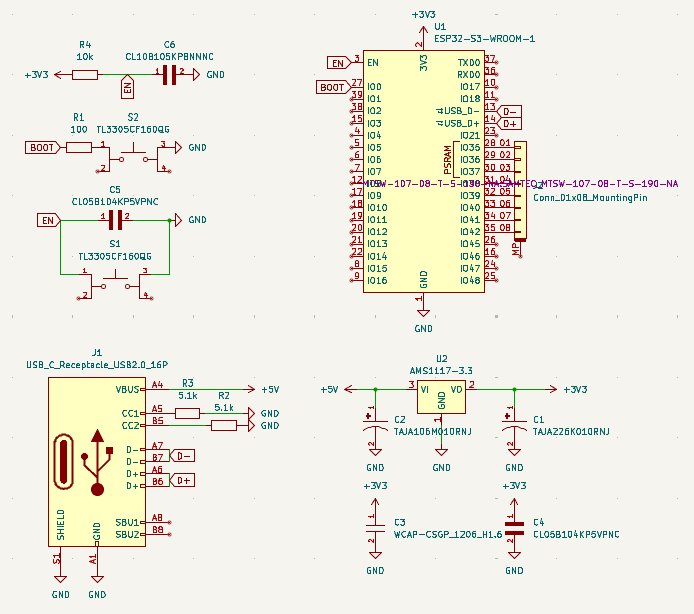

# ESP32 Breakout Board

A simple breakout board for the ESP32, designed in KiCad as a quick guide to PCB design and prototyping.

## Overview

This project provides a straightforward, easy-to-assemble breakout board for the ESP32 microcontroller. It's intended for anyone interested in learning PCB design, prototyping, or working with the ESP32 platform.

## Features

- Designed with KiCad, a popular open-source PCB design tool
- Breaks out all essential ESP32 pins for easy prototyping
- Compact and beginner-friendly layout

## Images

### Schematic

### 2D Model

### 3D Model

## Getting Started

1. Download the KiCad project files from this repository.
2. Open the project in KiCad to view or modify the schematic and PCB layout.
3. Export Gerber files for manufacturing if you wish to fabricate the PCB.

---